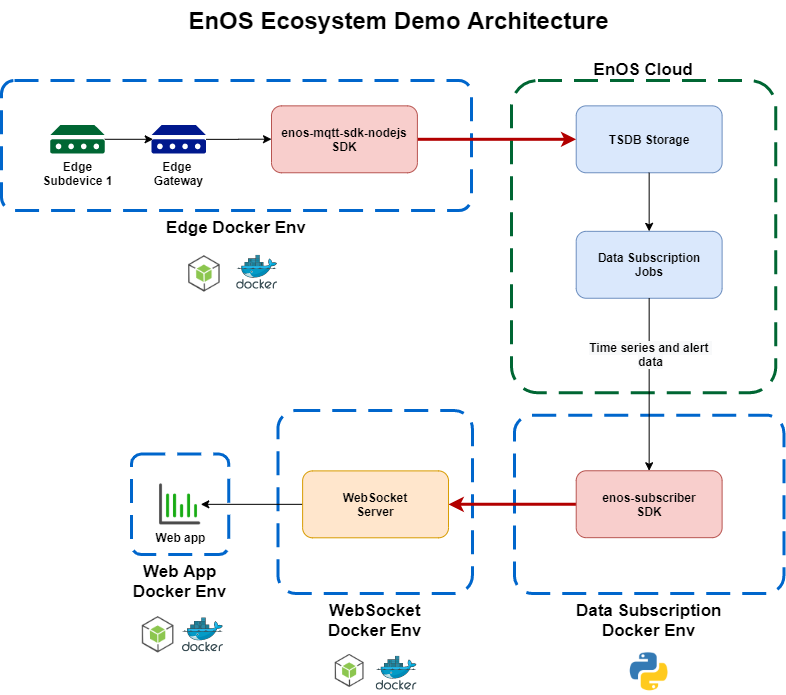

# enos-ecosystem-demo

## Introduction
EnOS ecosystem demo is to demostrate how a device simulate the device data to EnOS and streaming real-time data from EnOS to a third party dashboard.

## Reference architecture

## Techology stack
- Docker
- NodeJS
- Python
- EnOS Platform
- https://github.com/EnvisionIot/enos-device-sdk-nodejs
- https://github.com/EnvisionIot/enos-subscription-service-sdk-python

## Prerequitsites

### Add an .env file
<pre>
ORG_ID=[ENOS_ORGANIZATION_UNIT_ID]
API_GATEWAY_URL=[ENOS_APIM_URL]
APP_ACCESS_KEY=[ENOS_APPLICATION_ACCESS_KEY]
APP_ACCESS_SECRET=[ENOS_APPLICATION_ACCESS_SECRET]
EDGE_GATEWAY_PORT=9000
EDGE_GATEWAY_PRODUCT_KEY=[ENOS_EDGE_GATEWAY_PRODUCT_KEY]
PPE_BROKER_URL=[ENOS_BROKER_URL]
DATE_SUBSCRIBER_PORT_ALERT=9002
DATE_SUBSCRIBER_PORT_TIMESERIES=9003
SUBSCRIPTION_HOST=[ENOS_SUBSCRIPTION_HOST_URL]
SUBSCRIPTION_PORT=9001
SUBDEVICE_MODEL_ID=[ENOS_SUBDEVICE_MODEL_ID]
SUBSCRIPTION_ID_ALERT=[ENOS_ALERT_SUBSCRIPTION_ID]
SUBSCRIPTION_ID_TIMESERIES=[ENOS_TIME_SERIES_SUBSCRIPTION_ID]
WEBSOCKET_PORT=8765
</pre>

## dashboard
This is a container that host a React based dashboard and publish the incoming timeseries and alert data to dashboard chart.

## data-subscriber-alert
This is a container that use EnOS subscriber python SDK to stream the real-time alert data.

## data-subscriber-timeseries
This is a container that use EnOS subscriber python SDK to stream the real-time timeseries data.

## edge-gateway
This is a container that simulate an Edge Gateway and use EnOS device connectivity SDK to publish the device data into EnOS.

## edge-subdevice
This is a container that simulate a device to publish the device data to simulated Edge Gateway.

## websocket-server
This is a container that simulate a web socker server that will receive the streamed timeseries and alert data from data subscriber containers and broadcast to the dashboard.

## How to run this demo
To run the demo, run the following command in a new terminal.
<pre>docker-compose build | docker-compose up</pre>

## How to stop this demo
To stop the demo, run the following command in another terminal
<pre>docker-compose down</pre>
